# Documentation

Example：


## 1. Configuration

1. Run the script file：`markdown2potplayer.exe`
2. Double-click the tray icon in the lower right corner 
It will show this menu:

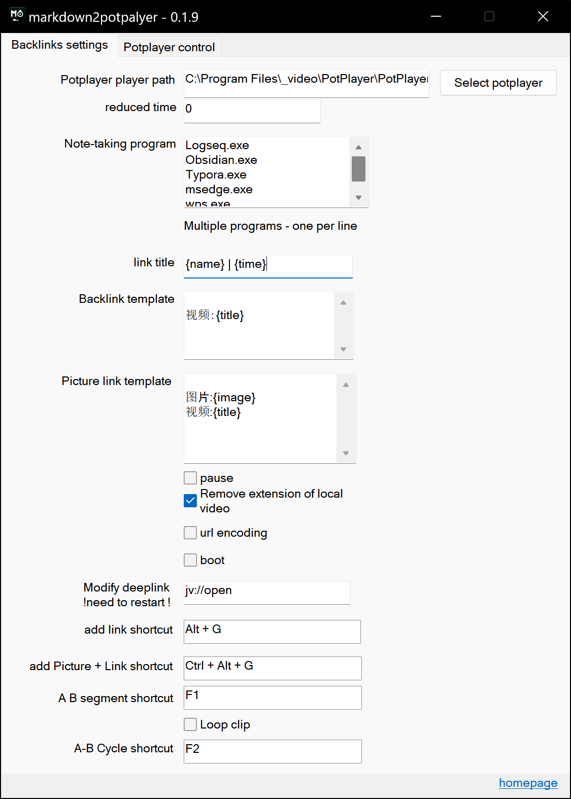

**Modification 1**：Enter the full path to the Potplayer executable file on your machine
**Modification 2**：List your note-taking software(s), use one line per item

- `note`：It will only paste backlinks to the first opened app from the list, from top to bottom :
  - For example：is both `obsidian` and `typora` are configured in the list :
    - if obsidian and typora are both opened, links will only be pasted into obsidian (1st in the list).
    - if only typora is open, then link will be pasted into typora


## 2. Usage

1.open `markdown2potplayer`
2. Open your note-taking app (logseq, obsidian, etc...)
3. Open potplayer
4. with either the note-taking app or potplayer `window activated`，<b style="color:red">Press the hotkey alt+g (default)</b> to automatically paste a link to the video into your app (with timestamp)
5. <b style="color:red">ctrl+alt+g (default)</b> will paste a link with a picture

# advanced settings

## using Notion.so

1. As Notion runs in a browser, so you need to specify the name of the browser executable
2. the script supports the following browsers:
   * Microsoft Edge: `msedge.exe`
   * Google: `chrome.exe`
   * 360 Express Edition: `360chrome.exe`
   * Firefox: `firefox.exe`

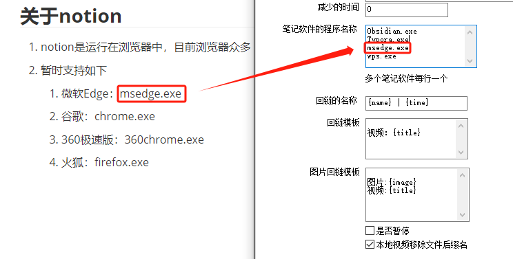


## Customizing Templates

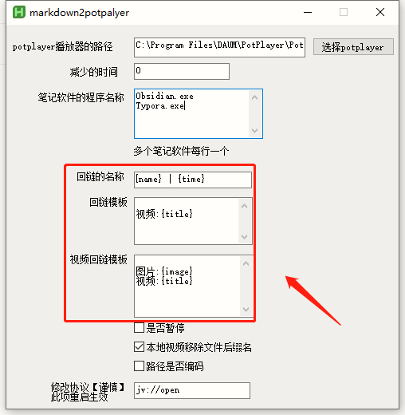

You can define Templates for the links, using one or multiple variables.

**Note**: There are 4 variables in total, but they are not always available in all locations :

* The `title` of the back link : `{name}` and `{time}` can be used
* Back link template: only `{title}` can be used
* Video link template: only `{image}` and `{title}` can be used


the variables :

-`{name}`: the file name of the video
-`{time}`: the current timestamp
-`{title}`: the link in markdown format, eg: `[Baidu](https://www.baidu.com)`
-`{image}`: location of the pasted image (filepath) 


### Example 1

I want `Alt+G` to paste this template :

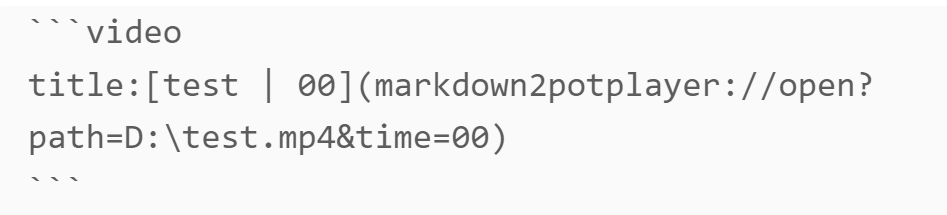

This should be filled in here

1. First define the link label `[]` in the **backlink**, here we input:
```
{name} | {time}
```

2. Next, define **the template**

````
```Video
title: {title}
```
````
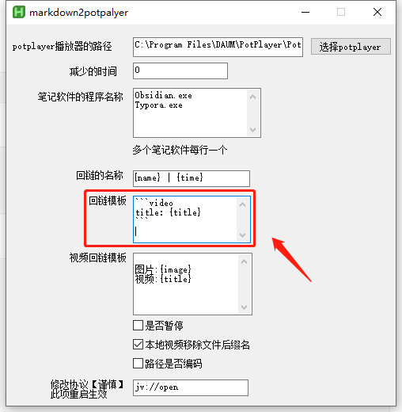

### Example 2

I want `ctrl+alt+g` to paste this template :

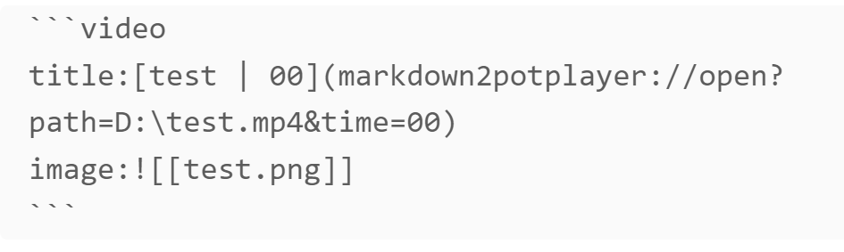

The video link template should be filled in like this

````ini
```video
title:{title}
image:{image}
```
````


## Play Bilibili station video

1. Need to install Potplayer  plug-ins in advance：[chen310/BilibiliPotPlayer](https://github.com/chen310/BilibiliPotPlayer)

2. Follow the plug-in usage documentation to play the video in potplayer.
3. Use shortcut keys to stamp the timestamp


## Adjust the time format
here

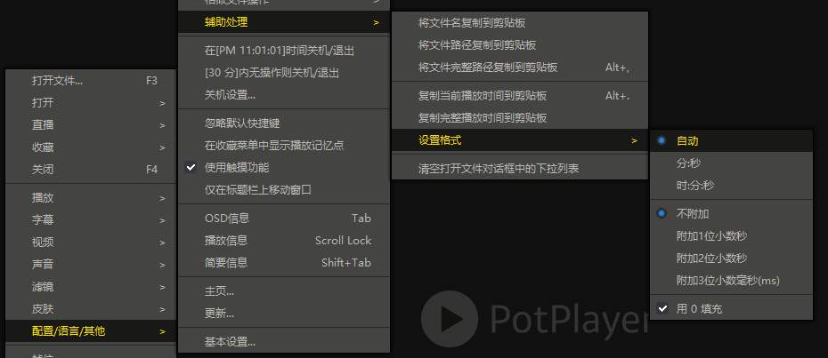


## A-B segment

**use**:

1. For the first time, press the shortcut key to record the starting point

2. Again, press the shortcut key to record the end point, generate a back link, and insert it into the note-taking software


**Notice**:

1. When the starting point **is greater than **the end point, for example: the starting point is 05:00 and the end point is 01:00, then `swap the starting point and the end point`, the starting point is 01:00 and the end point is 05:00
2. When pressing the shortcut key of the starting point, **if you want to cancel**, just press `Esc`


### AB segment

Play **single**, play at the starting point, pause at the end point

After playing, if you don’t want to pause at the end point, press `Esc` to cancel the end point pause.


### AB loop

Use the "AB segment loop" that comes with Potplayer to implement it. The default is **infinite playback**

**Close AB segment loop**: Potplayer**Default shortcut key `/`**


## The suffix name of the video file

Controls whether the filename extension is ​​included in the name

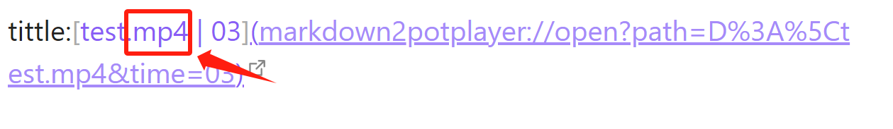


## Whether the address is encoded

Control the video address and whether to use url encoding

**The effect of turning off encoding**
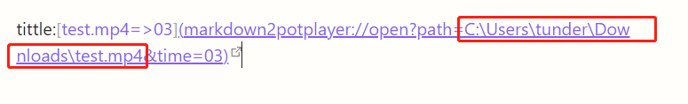

Notice

-Bugs discovered so far:
  1. Bug in urlencode in the whole system: If there are `\[`, `\!` in the path, in [ob's preview mode] (the link back will be automatically urlencoded by ob), the `\ in `\[` `disappears and becomes,`[`; for example: `G:\BaiduSyncdisk\123\[456]789.mp4` changes to: `G:\BaiduSyncdisk\123[456]789.mp4` under bugs <= `\ [` is missing `\`, so even if encoding is turned off, it will be forced to encode `\` in `\[` when `\[` appears in the path. If you do not want to be encoded, please do not name the video file like this or use `-`, `_`, etc. instead.
  2. After turning off encoding, if there are spaces in the path of the video, in obsidian's preview mode, the return link will not be rendered as a link, so even if encoding is turned off, spaces will be forced to be encoded. If you don’t want the spaces to be encoded, you can remove the spaces in the file or use `-`, `_`, etc. to replace the spaces.
-There may be other symbols with similar problems, but they have not been found yet.


## Potplayer Quick Control

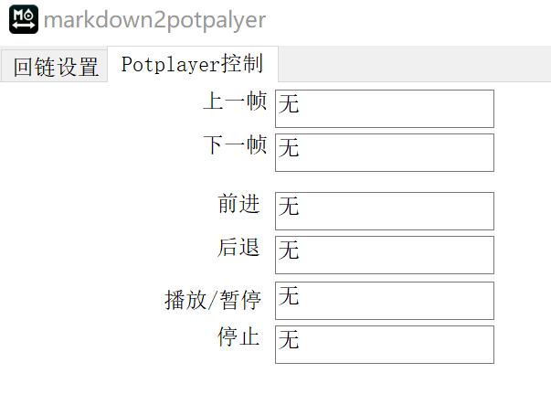

Conveniently control potplayer in note-taking software


**Forward and backward are accurate to `second`**

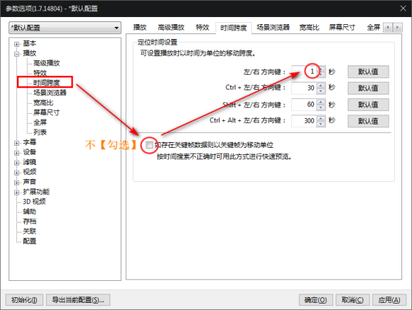

**Accurate to 0.5 seconds, etc.**

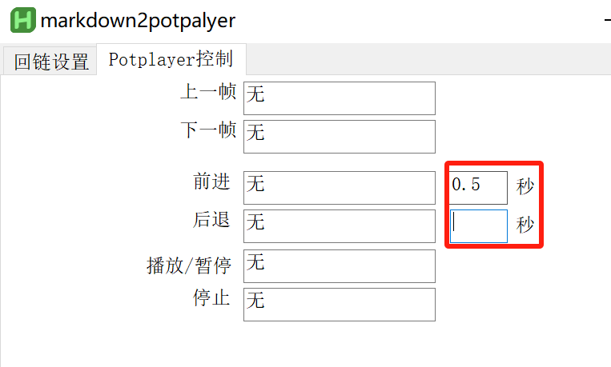

-Because potplayer comes with a minimum of 1 second, you can set 0.x seconds here.
-Notice:
  -If you fill in `0` or `do not fill in` any number, the time span set by the user in potplayer will be called.


## Custom jump protocol

Suitable for people who customize protocols [Caution]

The modification is here

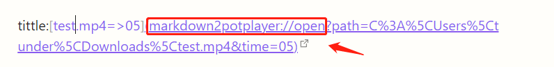


# Acknowledgments

grateful

-[Gold](https://github.com/fireflysss)
-[YIRU69](https://github.com/YIRU69)
-Canzi

Help and advice given!

# dev

compile the following files with ahk2exe using **ahk2.0 64bits**
* markdown2potplayer.ahk
* .\lib\note2potplayer\note2potplayer.ahk